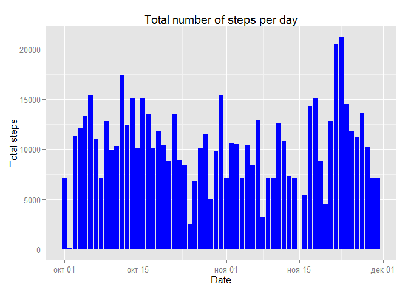

# Reproducible Research: Peer Assessment 1


## Loading and preprocessing the data
First we need to unzip and load data into the project:

```r
activity <- read.csv(unzip("activity.zip"))
```

Let`s look on the first ten rows and information about each colomn:

```r
head(activity, 10)
```

```
##    steps       date interval
## 1     NA 2012-10-01        0
## 2     NA 2012-10-01        5
## 3     NA 2012-10-01       10
## 4     NA 2012-10-01       15
## 5     NA 2012-10-01       20
## 6     NA 2012-10-01       25
## 7     NA 2012-10-01       30
## 8     NA 2012-10-01       35
## 9     NA 2012-10-01       40
## 10    NA 2012-10-01       45
```

```r
summary(activity)
```

```
##      steps                date          interval     
##  Min.   :  0.00   2012-10-01:  288   Min.   :   0.0  
##  1st Qu.:  0.00   2012-10-02:  288   1st Qu.: 588.8  
##  Median :  0.00   2012-10-03:  288   Median :1177.5  
##  Mean   : 37.38   2012-10-04:  288   Mean   :1177.5  
##  3rd Qu.: 12.00   2012-10-05:  288   3rd Qu.:1766.2  
##  Max.   :806.00   2012-10-06:  288   Max.   :2355.0  
##  NA's   :2304     (Other)   :15840
```

```r
str(activity)
```

```
## 'data.frame':	17568 obs. of  3 variables:
##  $ steps   : int  NA NA NA NA NA NA NA NA NA NA ...
##  $ date    : Factor w/ 61 levels "2012-10-01","2012-10-02",..: 1 1 1 1 1 1 1 1 1 1 ...
##  $ interval: int  0 5 10 15 20 25 30 35 40 45 ...
```

As we see, the second colomn has Factor type. Let`s make it Date:

```r
activity$date <- as.Date(activity$date)
str(activity)
```

```
## 'data.frame':	17568 obs. of  3 variables:
##  $ steps   : int  NA NA NA NA NA NA NA NA NA NA ...
##  $ date    : Date, format: "2012-10-01" "2012-10-01" ...
##  $ interval: int  0 5 10 15 20 25 30 35 40 45 ...
```

Now looks better!

## What is mean total number of steps taken per day?

First we will make a table with dates and number of steps per day

```r
library(plyr)
```

```
## Warning: package 'plyr' was built under R version 3.2.1
```

```r
library(dplyr)
```

```
## Warning: package 'dplyr' was built under R version 3.2.1
```

```
## 
## Attaching package: 'dplyr'
## 
## The following objects are masked from 'package:plyr':
## 
##     arrange, count, desc, failwith, id, mutate, rename, summarise,
##     summarize
## 
## The following objects are masked from 'package:stats':
## 
##     filter, lag
## 
## The following objects are masked from 'package:base':
## 
##     intersect, setdiff, setequal, union
```

```r
steps_per_day <- ddply(activity,.(date),summarize,total_steps=sum(steps, na.rm=TRUE))
head(steps_per_day)
```

```
##         date total_steps
## 1 2012-10-01           0
## 2 2012-10-02         126
## 3 2012-10-03       11352
## 4 2012-10-04       12116
## 5 2012-10-05       13294
## 6 2012-10-06       15420
```

There is a histogram of the total number of steps per day:

```r
library(ggplot2)
```

```
## Warning: package 'ggplot2' was built under R version 3.2.1
```

```r
g <- ggplot(steps_per_day, 
            aes(x=date, 
                y=total_steps))
g <- g + geom_bar(fill="#0000ff", stat="identity")
g <- g + labs(x = "Date") 
g <- g + labs(y = "Total steps") 
g <- g + labs(title="Total number of steps per day")
g
```

 

The mean and median of total number of steps are:

```r
steps_mean <- mean(steps_per_day$total_steps)
steps_median <- median(steps_per_day$total_steps)
```
mean = ``9354.2295082``;

median = ``10395``;

## What is the average daily activity pattern?

We will make a table of 5-minutes intervals and the average number of steps taken, averaged across all days:

```r
avg_interval <- ddply(activity,.(interval),summarize,avg_steps=mean(steps, na.rm=TRUE))
head(avg_interval)
```

```
##   interval avg_steps
## 1        0 1.7169811
## 2        5 0.3396226
## 3       10 0.1320755
## 4       15 0.1509434
## 5       20 0.0754717
## 6       25 2.0943396
```


Then make a plot:

```r
g <- ggplot(avg_interval, 
            aes(x=interval, 
                y=avg_steps))
g <- g + geom_line()
g <- g + labs(x = "Interval") 
g <- g + labs(y = "Average number of steps") 
g <- g + labs(title="average daily activity")
g
```

 

Then find a 5-minute interval with maximum number of steps:

```r
max_interval <- avg_interval$interval[which.max(avg_interval$avg_steps)]
```

So, the ``835`` 5-minute interval contains the maximum number of steps.

## Imputing missing values

Let`s calculate a number of missing values in our dataset:

```r
NA_number <- sum(is.na(activity$steps))
```
There are ``2304`` missing values.

Now we will fill all NA values by the mean for that 5-minute interval


```r
missing <- which(is.na(activity))
new_activity <- activity

new_activity$steps[missing] <- avg_interval$avg_steps[activity$interval[missing] / 5 + 1]
head(new_activity, 10)
```

```
##        steps       date interval
## 1  1.7169811 2012-10-01        0
## 2  0.3396226 2012-10-01        5
## 3  0.1320755 2012-10-01       10
## 4  0.1509434 2012-10-01       15
## 5  0.0754717 2012-10-01       20
## 6  2.0943396 2012-10-01       25
## 7  0.5283019 2012-10-01       30
## 8  0.8679245 2012-10-01       35
## 9  0.0000000 2012-10-01       40
## 10 1.4716981 2012-10-01       45
```

```r
new_steps_per_day <- ddply(new_activity,.(date),summarize,total_steps=sum(steps, na.rm=TRUE))
head(new_steps_per_day)
```

```
##         date total_steps
## 1 2012-10-01     7075.34
## 2 2012-10-02      126.00
## 3 2012-10-03    11352.00
## 4 2012-10-04    12116.00
## 5 2012-10-05    13294.00
## 6 2012-10-06    15420.00
```

There is a histogram of the total number of steps per day without NA values:

```r
g <- ggplot(new_steps_per_day, 
            aes(x=date, 
                y=total_steps))
g <- g + geom_bar(fill="#0000ff", stat="identity")
g <- g + labs(x = "Date") 
g <- g + labs(y = "Total steps") 
g <- g + labs(title="Total number of steps per day")
g
```

 

New mean and median of total number of steps are:

```r
new_steps_mean <- mean(new_steps_per_day$total_steps)
new_steps_median <- median(new_steps_per_day$total_steps)
```
new_mean = ``1.0282143\times 10^{4}``;

new_median = ``1.0395\times 10^{4}``;

There is a difference between that values with and without NA:

mean - new_mean = ``-927.9133931``;

median - new_median = ``0``;

## Are there differences in activity patterns between weekdays and weekends?

Next step we will create a new factor variable in the dataset with two levels – “weekday” and “weekend” indicating whether a given date is a weekday or weekend day:

```r
Sys.setlocale("LC_TIME", "English_Australia.1252")
```

```
## [1] "English_Australia.1252"
```

```r
new_activity$w <- factor(ifelse(weekdays(new_activity$date,abbreviate=TRUE) %in% c("Sat","Sun"), "weekend","weekday"))
head(new_activity, 10)
```

```
##        steps       date interval       w
## 1  1.7169811 2012-10-01        0 weekday
## 2  0.3396226 2012-10-01        5 weekday
## 3  0.1320755 2012-10-01       10 weekday
## 4  0.1509434 2012-10-01       15 weekday
## 5  0.0754717 2012-10-01       20 weekday
## 6  2.0943396 2012-10-01       25 weekday
## 7  0.5283019 2012-10-01       30 weekday
## 8  0.8679245 2012-10-01       35 weekday
## 9  0.0000000 2012-10-01       40 weekday
## 10 1.4716981 2012-10-01       45 weekday
```


```r
library(reshape2)
```

```
## Warning: package 'reshape2' was built under R version 3.2.2
```

```r
activity_melt <- melt(new_activity, id.vars = c("w", "interval"), measure="steps")
steps_mean <-dcast(activity_melt, w + interval ~ variable, fun = mean)

library(lattice)
xyplot(steps ~ interval | w, data = steps_mean, type='l', layout = c(1, 2), ylab="number of steps")
```

 
